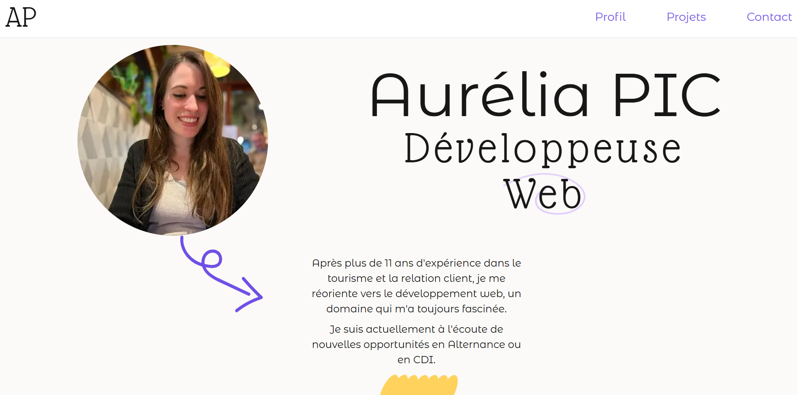

# Hi there 👋 I'm Aurélia 🤗
 

    

### 💃🏻 About Me:
Love to travel, play video games, and RPGs. Tired (of people) after working 11 years as a receptionist, I finally started thinking about myself and what I truly love. I began learning to code in 2023 and joined an intensive remote boot camp in May 2024 at Wild Code School.  
Currently, I'm progressing in a comprehensive training at Diginamic, focusing on a broader tech stack with a focus on both frontend and backend technologies.  

### 🌱 Currently learning at Diginamic 
JAVASCRIPT - NODE.JS - JAVA - SPRING - ANGULAR - UML - MAVEN - DOCKER  

### Previously ~ 
REACT - NEXT - NODE.JS - EXPRESS.JS - SPLINE - MYSQL - GSAP - JS - REACT NATIVE - TYPESCRIPT - TAILWIND   

### 🌐 Socials:
 

### 💻 Tech Stack:
              

     
    

 
  

<!-- Projects -->
<h1 align="center">My latest projects 👨‍💻</h1>

  <table>
        <tr>
		<td width="50%">
                <h3 align="center">
                    <a href="https://www.aureliapic.fr/" rel="noreferrer"> Portfolio ! 🌸</a>
                </h3>
                

                    
                    

                        My deployed portfolio
                    

					

						

						<b>Note 📝</b>
						

						I used Next.js, TypeScript, Tailwind & Gsap.
					

            		

           	 </td>
		<td width="50%">
                <h3 align="center">
                    <a href="#" rel="noreferrer"> Pokédex Team Rocket 📱</a>
                </h3>
                

                    
                    

                        Interactive Pokedex App
                    

					

						

						<b>Note 📝</b>
						

						I used React Native, TypeScript, Express & SQLite.
					

            		

            	</td>
	     <tr>
            <td width="50%">
                <h3 align="center">
                    <a href="#" target="_blank" rel="noreferrer"> Renardor's Revenge 🦊</a>
                </h3>
                

                    <a href="#" target="_blank" rel="noreferrer"> <video src="https://github.com/user-attachments/assets/6dc90891-3333-4596-baa5-99cc14ce4c6c" alt="miniature"/> </a>
                    

                        TowerDefense game 
                    

					

						

						<b>Note 📝</b>
						

						I used Unity & C#
					

            

            </td>
           <td width="50%">
                <h3 align="center">
                    <a href="#" rel="noreferrer"> Chemin Montessori 👼🏼</a>
                </h3>
                

                    
                    

                        Montessori workshop sales site
                    

					

						

						<b>Note 📝</b>
						

						I used React.js & Node.js/Express.js.
					

            

            </td>
	    <tr>
            <td width="50%">
                <h3 align="center">
                    <a href="https://cyber-mart.netlify.app/" target="_blank" rel="noreferrer"> CyberMart 📎</a>
                </h3>
                

                    
                    

                        Back to the futur in 90's !
                    

					

						

						<b>Note 📝</b>
						

						I used React & Node.js.
					

            

            </td>
            <td width="50%">
                            <h3 align="center">
                    <a href="https://univers-de-blibli.netlify.app/" target="_blank" rel="noreferrer">L'univers de Blibli 🌱</a>
                </h3>
                

                    
                    

                        Tribute to Ghibli Studio. Mini-Games and library.
                    

                    

                        

                        <b>Note 📝</b>
                        

                        I used React & Node.js/Express.js. Also used GSAP for animations.
                    

                

                

            </td>
        </tr>
  </table>

 
    
### 📊 GitHub Stats:

### 🔝 Top Contributed Repo

<!-- Proudly created with GPRM ( https://gprm.itsvg.in ) -->

<!--
**Aur3liaP/Aur3liaP** is a ✨ _special_ ✨ repository because its `README.md` (this file) appears on your GitHub profile.

